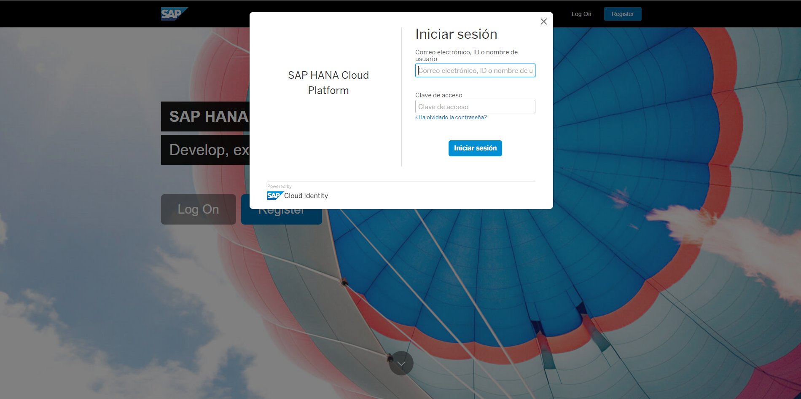
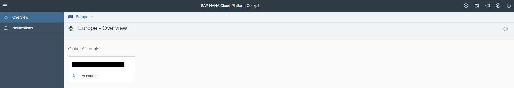
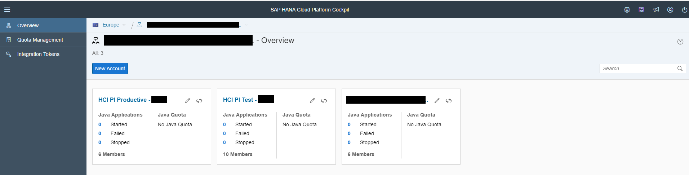
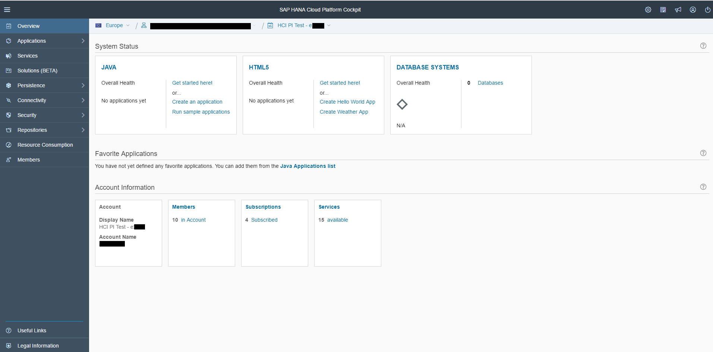
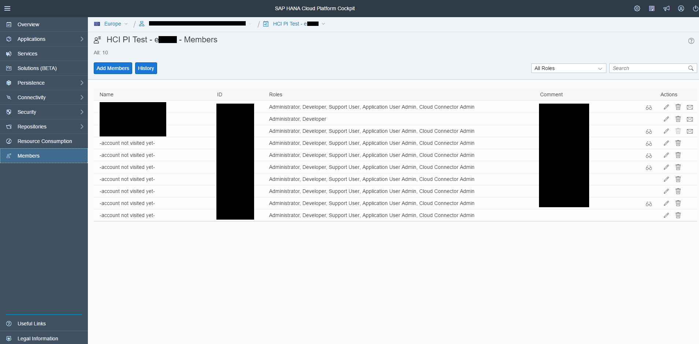
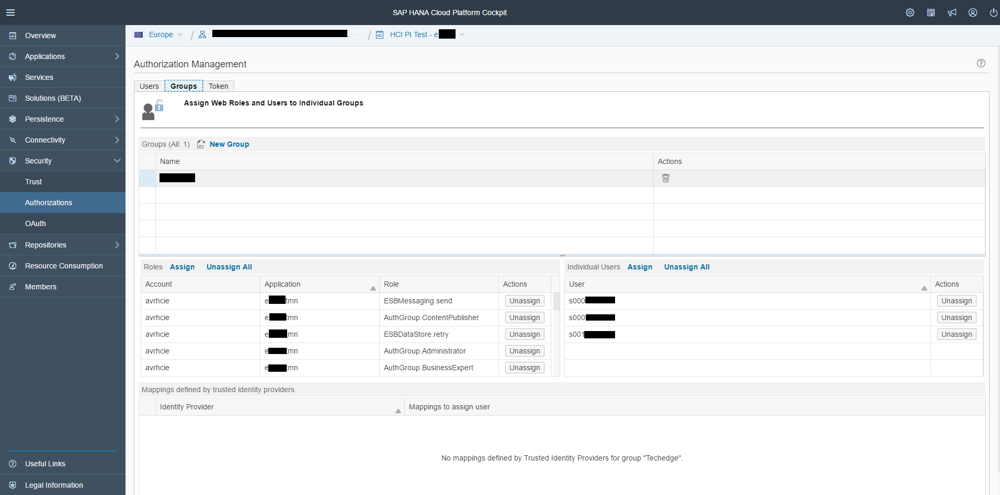
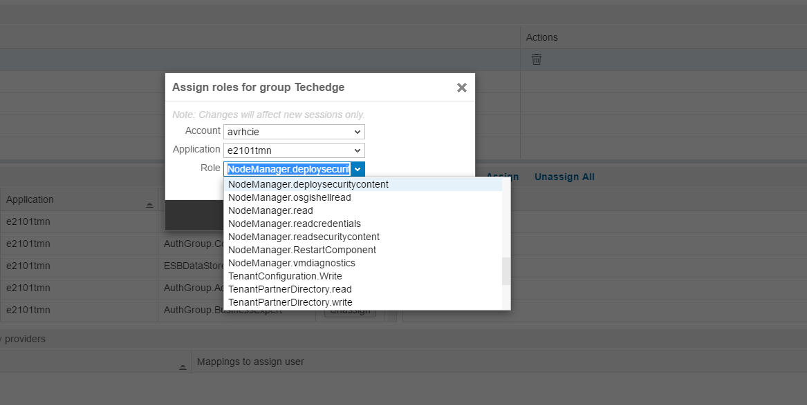

# Praparación del entorn en Hana Cloud Platform

Lo primero una vez tenemos el tenant será crear los usuarios que van a poder acceder al mismo desde el portal de [Hana Cloud Platform](https://cloudplatform.sap.com/index.html).

Se accede con un S-User de SAP mediante la ULR: <https://account.hana.ondemand.com/>

Una vez dentro observamos el nombre de la cuenta del cliente:

Donde al realizar clic con el ratón sobre el nombre veremos los diferentes sistemas que dispone.

Si realizamos otro clic con el ratón sobre el sistema se abrirá en la parte izquierda todas las opciones de las que disponemos.

***
## Miembros

Una de las primeras actividades que se tiene que realizar es la creación de miembros. Para ellos seleccionamos la opción “Members” situada en el menú de la izquierda.

Y creamos los usuarios necesarios con los roles que corresponda a cada uno.

***
## Grupos

Una vez creados los usuarios, se les asigna un grupo. Para la creación de los grupos se accede al menú de la izquierda en Security -> Authorizations.

Se ha creado el grupo donde se les ha asignado diferentes autorizaciones, sin estas no se podrá acceder al HCI. 

Una vez asignadas todas las autorizaciones se asignas los usuarios que hemos creado en el paso anterior. Assign -> Introduce el nombre del usuario a asignar.