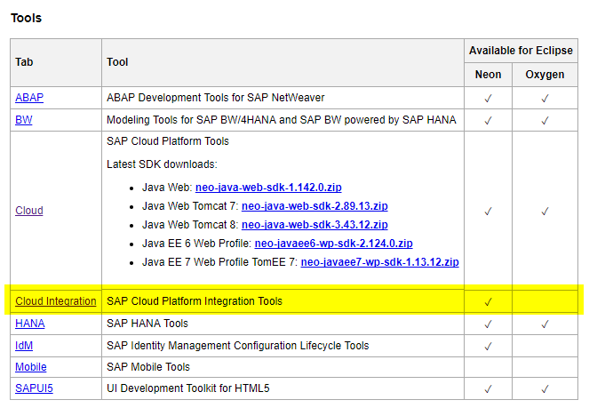
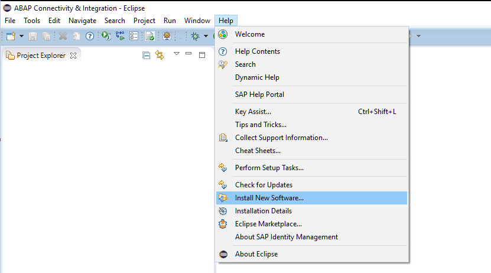
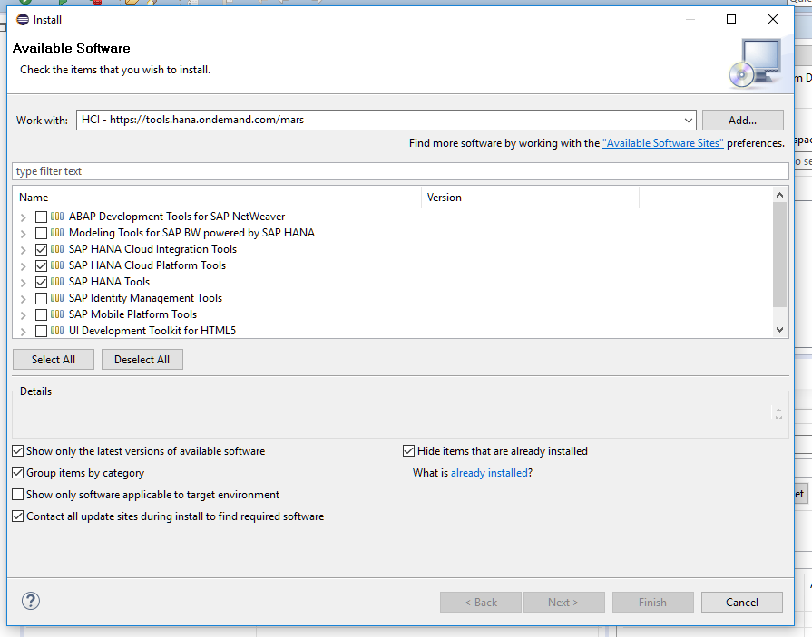
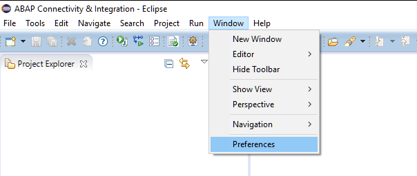
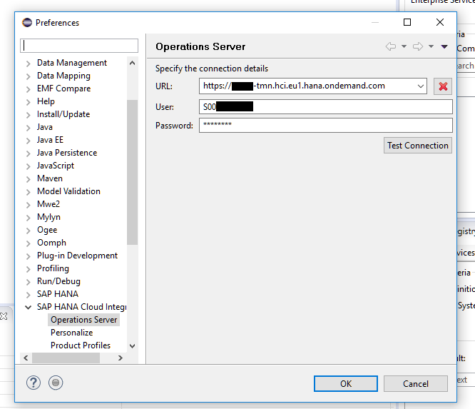
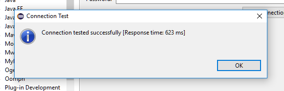
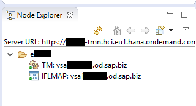
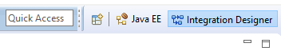

# Acceso al tenant de HCI

A un tenant de [Hana Cloud Integration](https://help.sap.com/viewer/product/CLOUD_INTEGRATION/Cloud/en-US) podemos acceder desde un browser a través de la webUI o bien conectándonos a través de [eclipse](https://www.eclipse.org/) previa instalación de los plugins necesarios.

* Web UI URL (Access via web browser):
````
https://{tenant_id}-tmn.hci.eu1.hana.ondemand.com/itspaces
````
* Management URL (Access via Eclipse HCI plugin):
````
https://{tenant_id}-tmn.hci.eu1.hana.ondemand.com
````
* Runtime URL (Webserviceurl to be configured in backend systems):
````
https://{tenant_id}-iflmap.hcisbt.eu1.hana.ondemand.com
````
***
## Instalación de eclipse para HCI
Desde la web <https://tools.hana.ondemand.com/> podemos comprobar la última versión de eclipse para la que disponemos de plugins actualizados para integración de HCI.

Este caso se trata de [eclipse neon](https://www.eclipse.org/neon/):



Una vez descargado el eclipse, debemos instalar los plugins de HCI desde: `Help > Install New Software...`



Se abrirá un pop-up donde tendremos que añadir la url: `https://tools.hana.ondemand.com/neon`



Seleccionamos e instalamos _**SAP HANA Cloud Integration Tools**_

Reiniciamos el eclipse una vez se complete la instalación.
***
## Conexión desde eclipse con el tenant de HCI
La configuración de la url del tenant de HCI se realiza desde: `Windows > Preferencias`



Buscamos en el menú: `SAP HANA Cloud Integration > Operation server`



Podemos comprobar que todo está correcto pulsado el botón `Test Connection`.



Si está bien configurado debe aparecer en el `Node explorer` en la parte inferior izquierda de la interface de eclipse:



Usaremos la perspectiva de 'Integration Designer` desde la cual podremos crear nuevos IFlows o bien importar alguno existente en el tenant al que nos hemos conectado.

