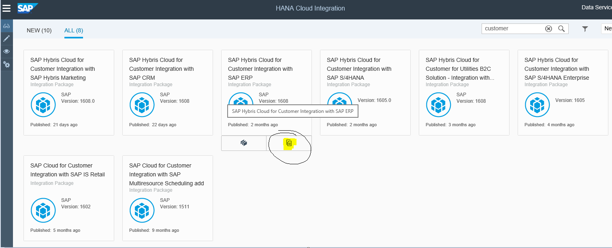
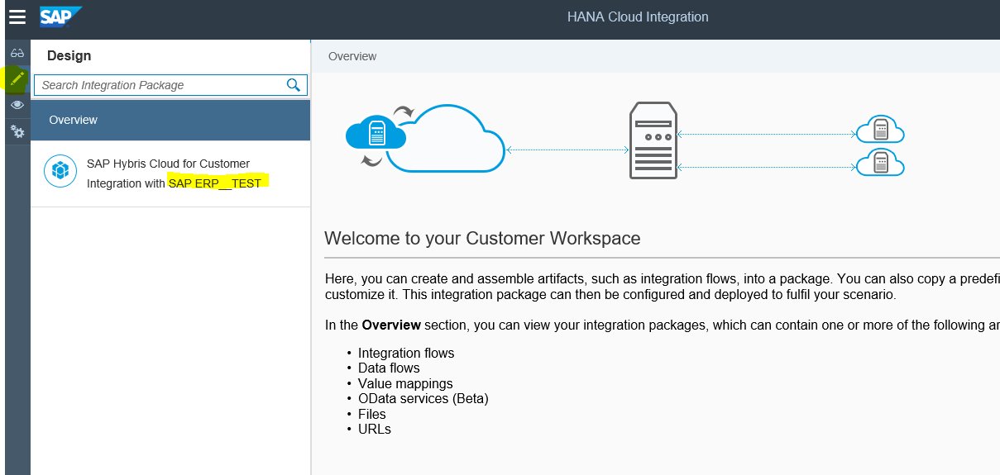
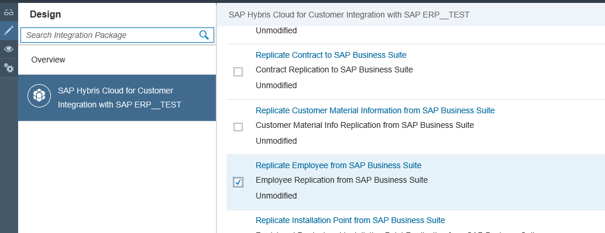
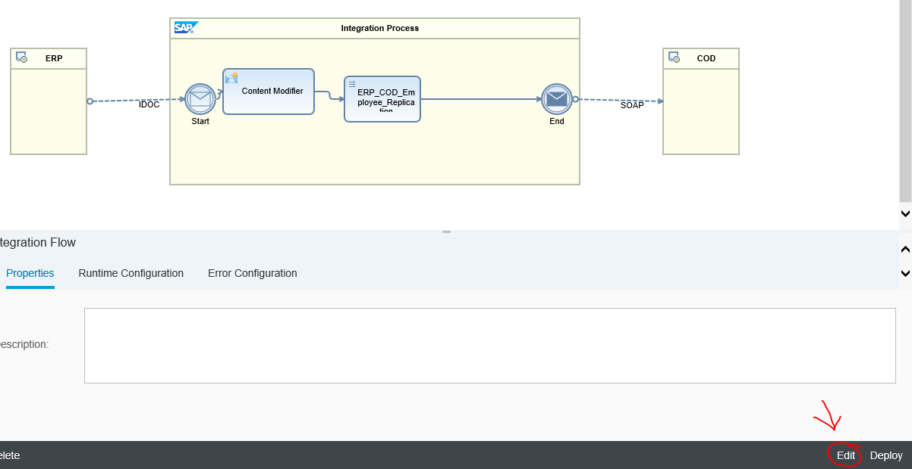
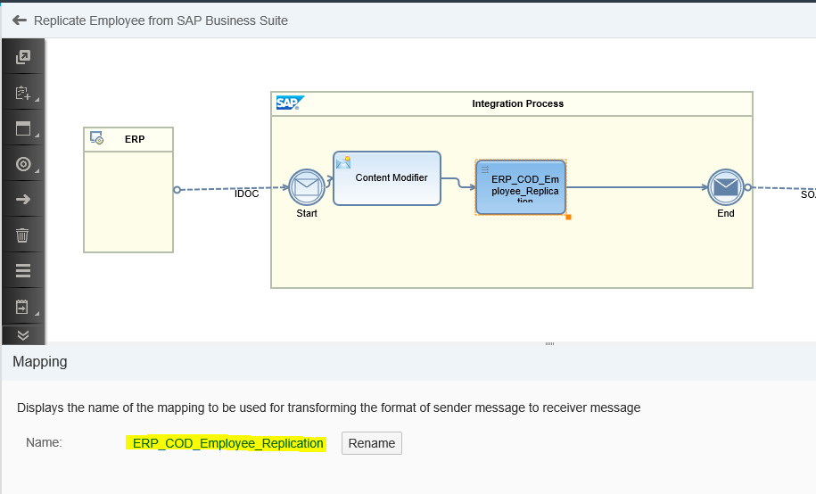
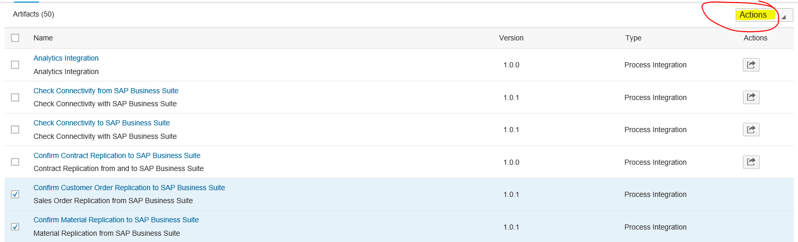
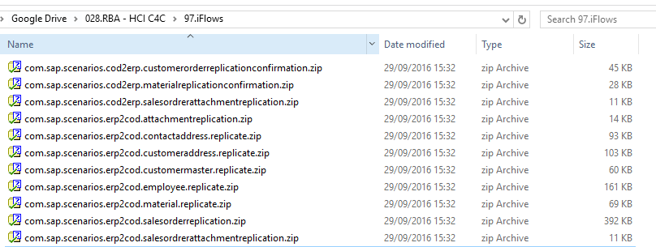
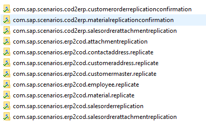

# Manejo de escenarios de integración desde HCI WebUI

Podemos acceder a la gestión de escenarios de integración con HCI desde un browser a través de la url:
````
https://{tenant_id}-tmn.hci.eu1.hana.ondemand.com/itspaces/shell/discover
````
Ahí se nos presentaran una serie de paquetes prediseñados para la integración de distintas soluciones de SAP.



Pulsado sobre el botón `Copy to workspace` haremos una copia local del paquete que hayamos seleccionado. Este paquete llevará el sufijo que hayamos seleccionado durante el proceso de copia.



Dentro de nuestro paquete seleccionamos el escenario o flujo de intagración (IFlow) con el que vamos a trabajar:



Pinchamos en el título del flujo que queremos modificar y se abrirá:



Pulsamos `Edit`.

Seleccionamos el elemento que deseamos editar y clickamos abajo donde el nombre de dicho elemento.



Ahí podremos editar mapeos, canales, etc.

***
## Exportar IFlows desde el WebUI de HCI

Se pueden exportar los IFlow estándar desde el WebUI hacia el eclipse para trabajar más cómodos. Para ello, entramos en HCI y elegimos los IFlows que deseamos exportar.



Pulsamos sobre: `Actions > Download`. Y descargaremos un `.zip` con todos los IFlows seleccionados.



Descomprimiendo estos `.zip` podremos importarlos directamente como proyectos de eclipse.

