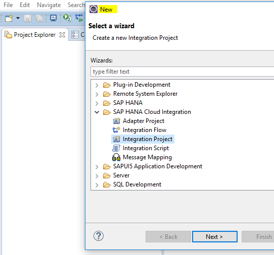
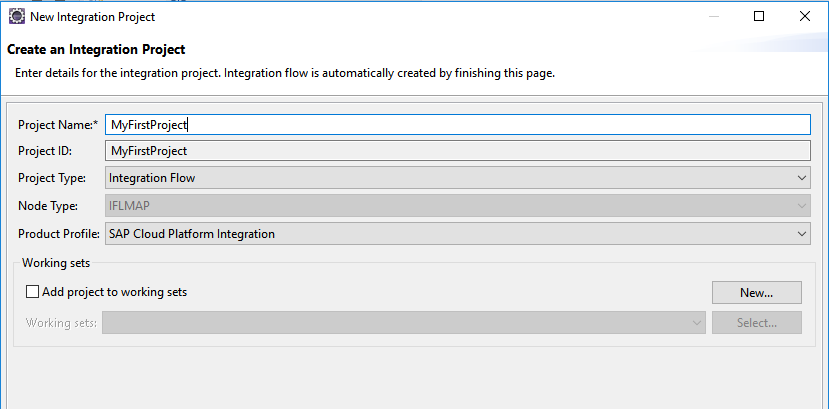
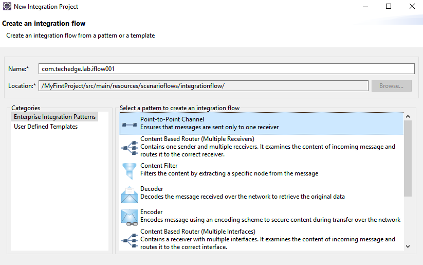
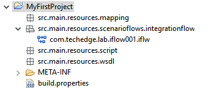
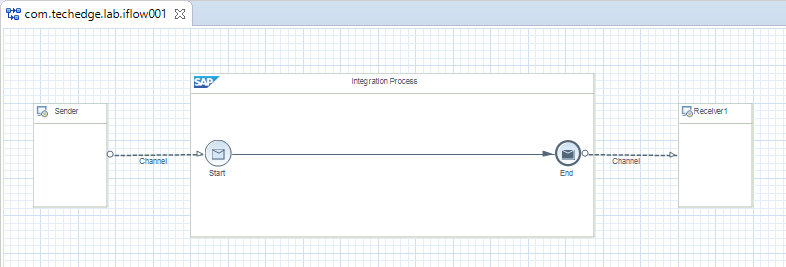
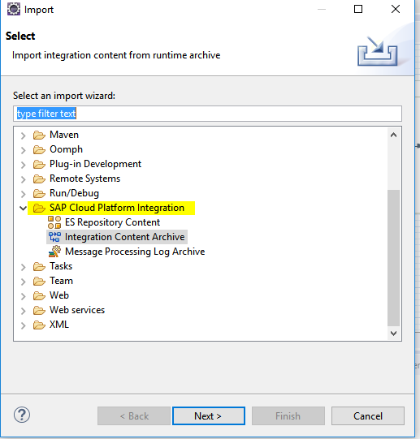
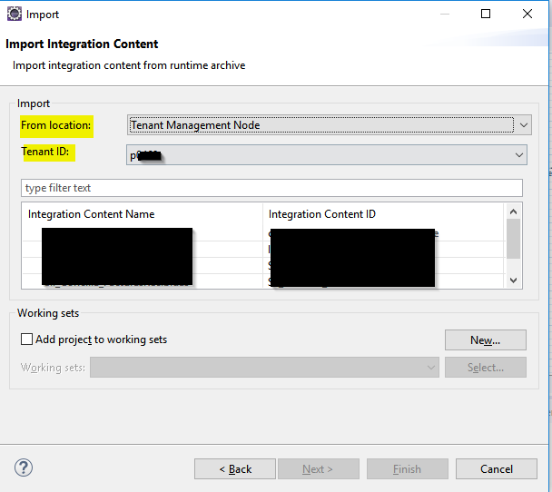
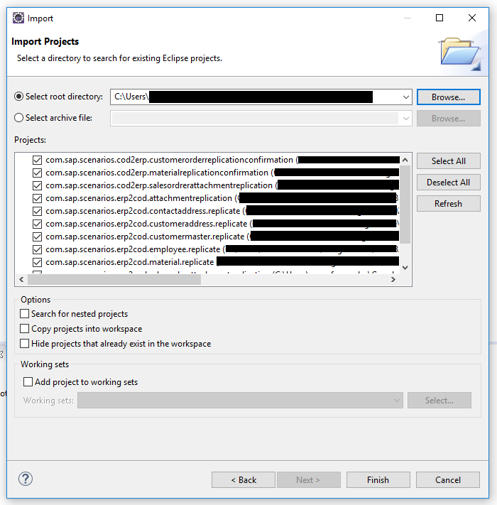
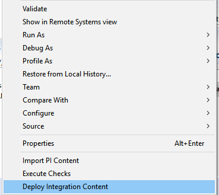
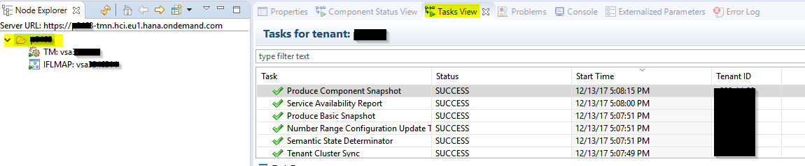

# Manejo de escenarios de integración desde eclipse

## Creación de nuevos escenarios de integración desde eclipse

Para crear un nuevo proyecto de integración deberemos seleccionar la perspectiva `Integrator Designer`

Desde el `Project explorer` hacemos click derecho: `New > Integration project`

Establecemos el nombre del proyecto (NOTA: este nombre es distinto del nombre del IFlow
)

Establecemos el nombre del IFlow

Se crea el nuevo proyecto

Una vez ahí podemos configurar nuestro IFlow creando nuestras estructuras de datos, mapeos, scripts, etc.
***
### Tipos de objetos en HCI

* **Estructuras de datos:** En HCI no existen Data Types, Message Types, etc. Todas las estructuras de datos se definen mediante ficheros **`.WSDL`**
* **Mappings:** Los mappings en HCI se realizan mediante ficheros del tipo **`Message Mapping`** que recibirán un `wsdl` como *source* u origen y realizarán la conversión a otro `wsdl` de *target* o destino.
* **Funciones _custom_:** En HCI las `UDFs (User Defined Functions)` no están implementadas hasta la fecha. Así mismo tampoco utilizar los típicos mapeos con `hojas de transformación (XSLT)` o con `Java Mappings`. La creación de funciones *custom* queda relegada a **`Groovy Scrips`** (de los que hablamore en secciones posteriores).
* **Flujos de integración:** Los escenarios de integración se configurarán mediante el uso de ficheros de tipo `.iflw` que representarán un `IFlow (Integration Flow)`

***
## Importar proyectos existentes en nuestro eclipse

Podemos importar proyectos ya creado en nuestro workspace bien desde archivos locales o bien desde el tenant de HCI.

### Importar proyecto desde el tenant de HCI

Para importar un proyecto que ya está desplegado en nuestro tenant de HCI, seleccionamos: `Import > Import > SAP Cloud Platform Integration > Integration Content Archive`

Seleccionamos `Tenant Managment Node` y los IFlows que queramos importar:

### Importar proyecto desde archivos locales

Seleccionamos `Import > Existing Project into workspace`.

***

## Desplegar IFlows en nuestro tenant desde eclipse
Una vez tenemos los proyectos importados / creados en nuestro workspace debemos modificar lo que sea necesario para configurar nuestro IFlow:
>* canal sender
>* canal receiver
>* certificados
>* credenciales de autenticación
>* parámetros externos
>* mappings

Una vez hemos terminado, click derecho sobre el proyecto `Deploy Integration Content`

Esta acción lanza el trigger de despliegue del IFlow, pero será necesario esperar a que termine el *build* y el *deploy* antes de poder utilizar nuestro flujo.

Podemos comprobar cuando ha terminado desde `Task View` seleccionado nuestro tenant en el `Node Explorer`

