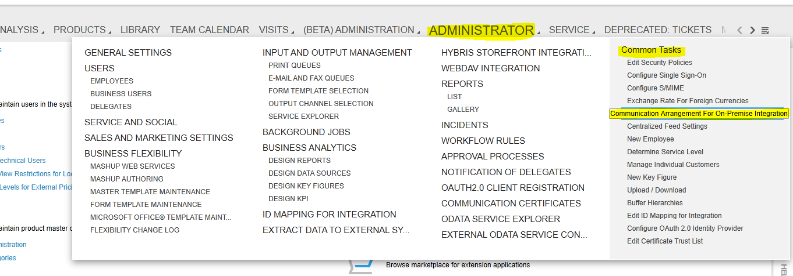
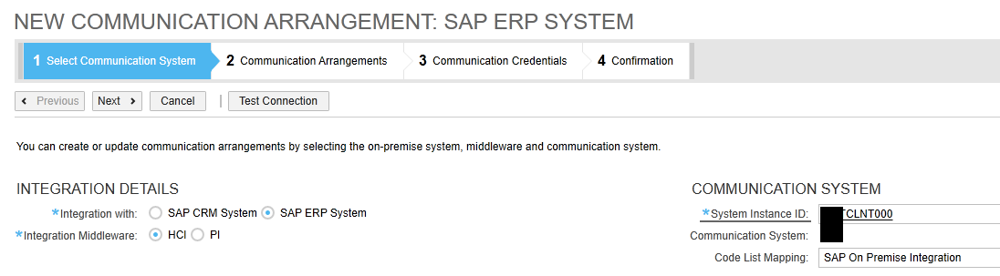
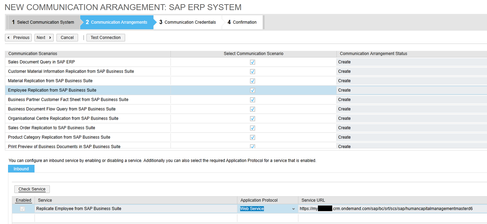
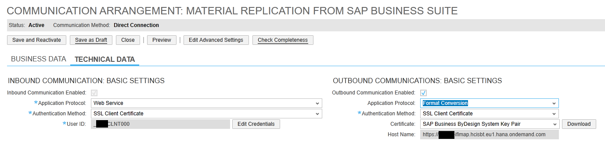
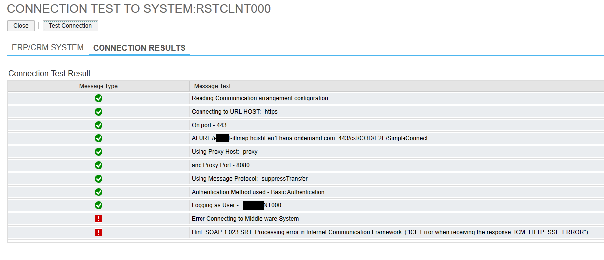

# Configuración de Cloud for Customer (C4C) para la integración con HCI

En el panel `Administration > Common Tasks > Communication Arrangements For on Premise Integration`

Rellenamos los campos y pulsamos en Next:

Seleccionamos los escenarios para los que queremos crear los communication arrangements (los que ya están creados no aparecerán). Ahí también podremos establecer si la comunicación va a ser inbound u outbound o ambos, y seleccionaremos que servicio llamará en cada caso.

Ahí podemos ver la URL del servicio en concreto.

Pulsamos `Next` para pasar a las `Communication Credentials`:

Ahí establecemos el método en el que será necesario autenticarse para usar tanto los servicios de inbound como de outbound, ya sea mediante certificados o usuario y contraseña.

Pulsando sobre `Edit Credentials` podemos establecer la contraseña del usuario o subir el certificado previamente descargado.

También podremos bajarnos el certificado de la parte outbound que habrá de ser cargado en el keystore de PI.

Pulsamos Finish para terminar de crearlo.

Podemos dar a Test Connection para probar que esté todo en orden.

