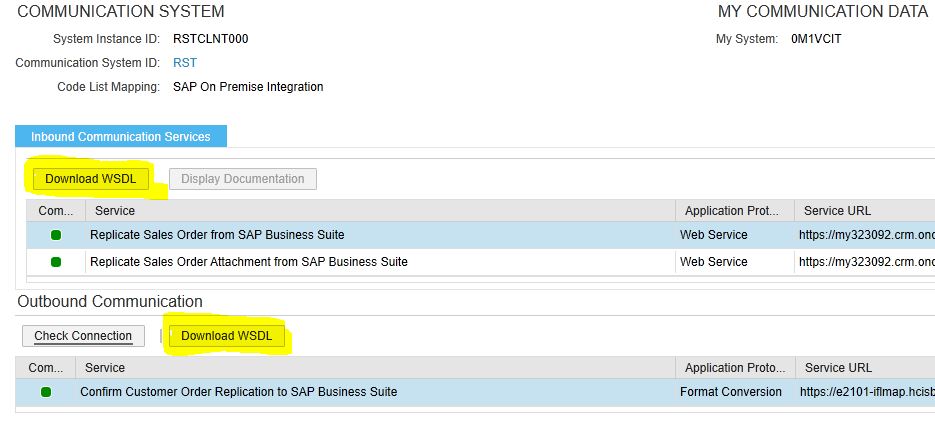
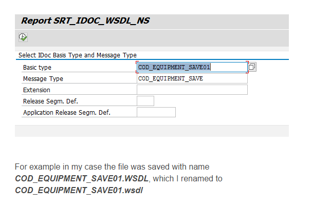
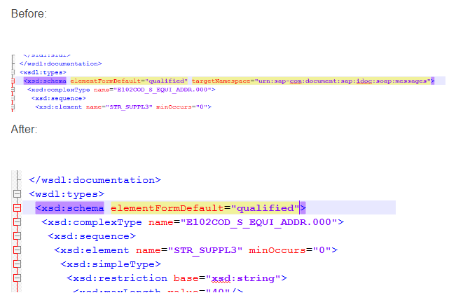
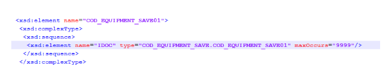
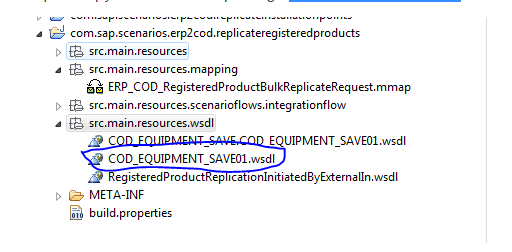
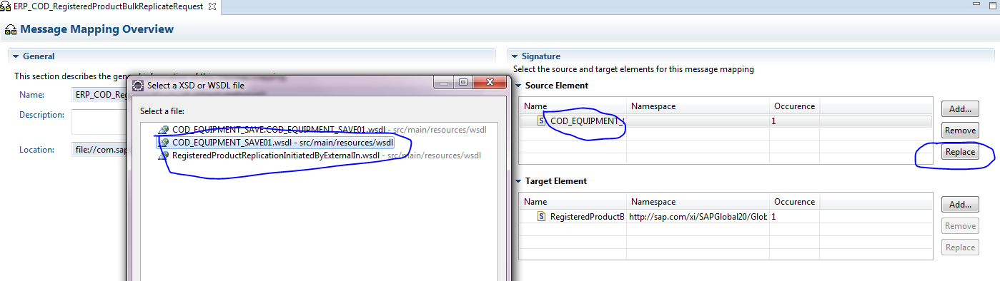
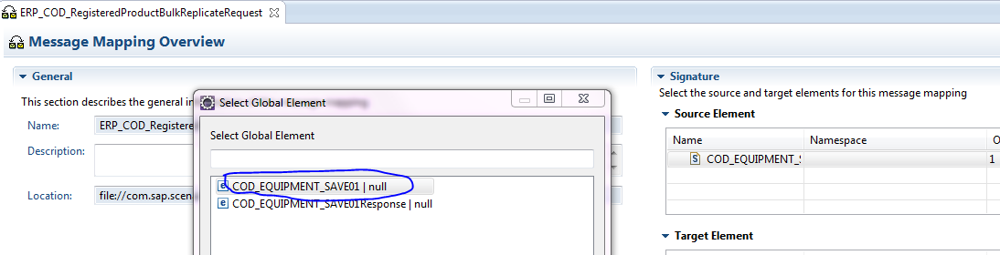
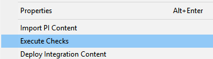
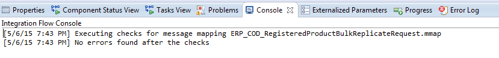

# Modificar IFlow cuando se amplia el modelo de datos en C4C y en SAP ECC de un escenario standard

En HCI normalmente trabajaremos con los IFlows standard, pero es posible que tengamos que extender el modelo de datos o bien modificar algún mapeo para ajustarse a nuestras necesidades.

***
## Obtener WSDL extendido de C4C
Una vez se extienda el modelo de datos en C4C podemos descarganos el nuevo WSDL desde `Administration > Integration > Communication Arrangements`

Seleccionamos el `Communication Arrangement` que queramos exportar y luego escogemos el que necesitemos (ya se a inbound o outbound) y nos bajamos el fichero con `Download WSDL`.

>**¡¡¡Los WSDL bajados deben llamarse exactamente igual que los WSDL del iflow estándar!!!**

***
## Obtener WSDL extendido de SAP ECC
Si extendemos o modificamos un IDOC estándar de SAP o bien queremos utilizar uno custom, debemos realizar lo siguiente:

1. Ejecutar el report (se38) `SRT_IDOC_WSDL_NS` para descargar La definición del IDOC en forma de WSDL *`(NOTA 1728487)`*.

_**(NOTA: renombrarlo de NOMBRE.WSDL a NOMBRE.wsdl para que lo pille bien el eclipse)**_

2. Abrir el wsdl y eliminar el `targetNamespace` y hacer un find and replace `“tns:”` con `“”`

3. Añadir el atriburo `maxOcurrs = 9999` al elemento IDoc para permitir mayor cardinalidad, y guardar el nuevo wsdl.

>**¡¡¡Los WSDL bajados deben llamarse exactamente igual que los WSDL del iflow estándar!!!**

***
## Importar WSDLs en iflow ya creado

1. Pegar los nuevos WSDL que deseamos importar en el paquete src.main.resources.wsdl del iflow en el que quedamos utilizarlo.

2. Reemplazamos la definición del IDOC original con la definición que hemos importado de nuestro nuevo WSDL en el editor de mapeos

3. Seleccionamos el message type (del wsdl).

4. Grabamos y comprobamos que no hay errors en el mapeo.

