# Crear IFlow síncrono para consumir WS publicado en SAP ECC

Creamos un nuevo proyecto en eclipse desde `New > Integration Project`

Necesitamos dos WSDL que se usarán tanto para definir los servicios como para definir las estructuras de datos que se usarán en los mappings.

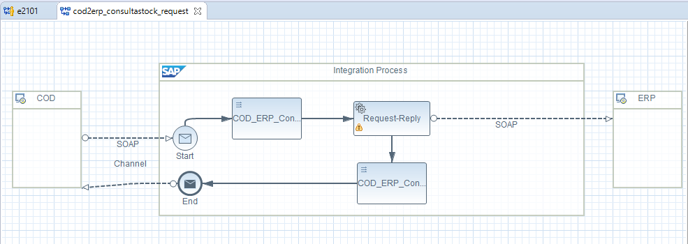

Aquí tenemos un ejemplo de `Request-Reply` para poder hacer un WS síncrono desde C4C a ECC.

El primer mapeo convierte desde la estructura request de C4C a la estructura request de SAP y el segundo mapeo, tras el `Request-Reply`, convierte desde la estructura response de SAP a la estructura response de C4C.

El canal sender SOAP se configura de la siguiente manera:

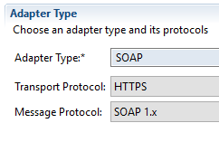
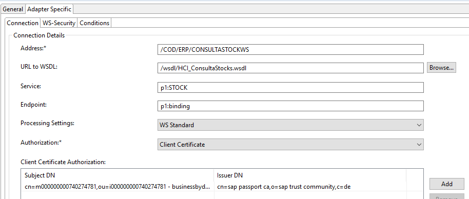

Siendo address la URL que deberá llevar igual el communication arrangement 

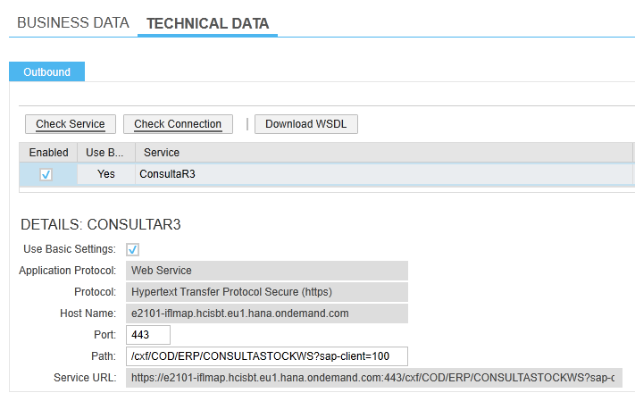

En URL to WSDL tendremos que establecer la estructura de nuestro servicio, así como los service, bindings, operations y demás parámetros para que se pueda invocar nuestro servicio.

Yo en este caso, utilicé el mismo WSDL que descargué de la `SOA MANAGER` con el servicio de que vamos a invocar en SAP, de manera que la estructura de datos será igual y no habrá que realizar mapeos. Hay que realizar algunos pequeños cambios para que se pueda utilizar este WSDL en el sender.

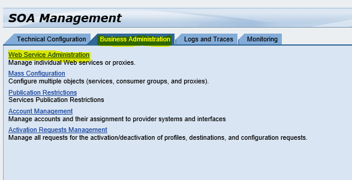

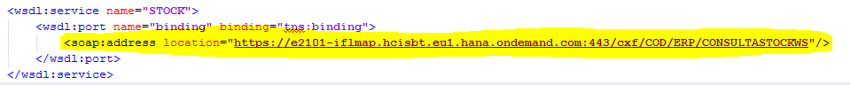

Reemplazar el `soapAction` vacío:

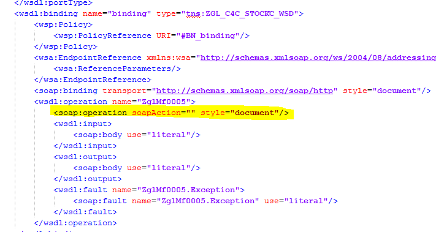

Por:

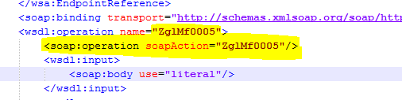

Al escoger este WSDL mediante el botón `Browse` el resto de campos se rellenan automáticamente, si lo definimos como variable en un `external parameter`, tendremos que rellenarlos a mano.

El canal receiver también será de tipo SOAP.

Y se configura con:

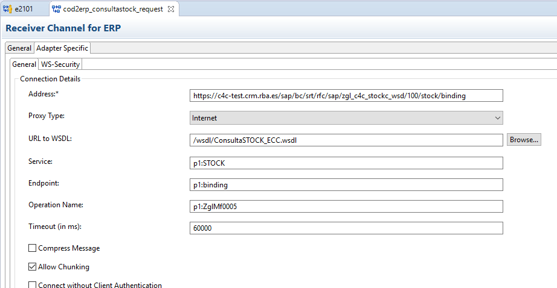

Podemos lanzar `Execute Check` para comprobar que el flujo está correcto y hacer deploy del mismo.

Para que la respuesta del WS receiver vuelva al sender, tenemos que crear un canal vacío desde el END hasta el sender. Así entiende HCI que es un flujo síncrono.

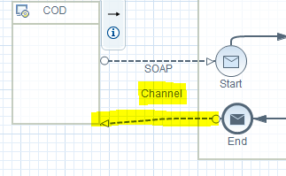

Para cambiar el nombre del flujo desplegado tenemos que tocar el fichero `MANIFEST.MF` dentro de la carpeta `META-INF`.

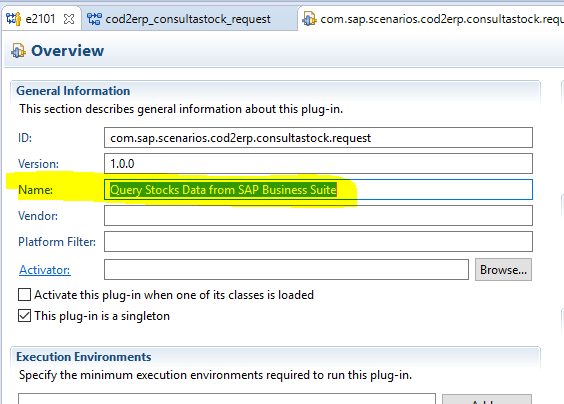