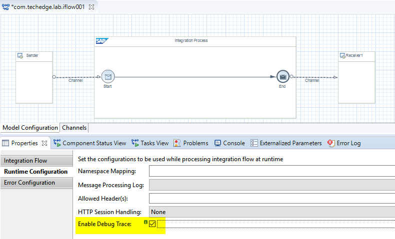
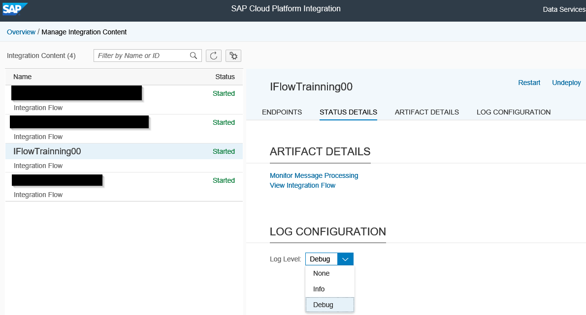
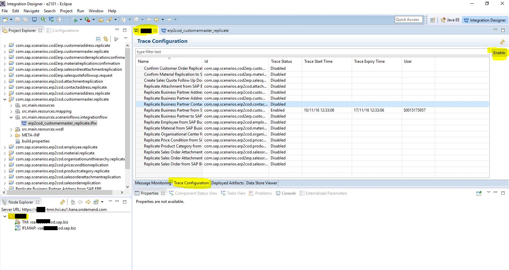
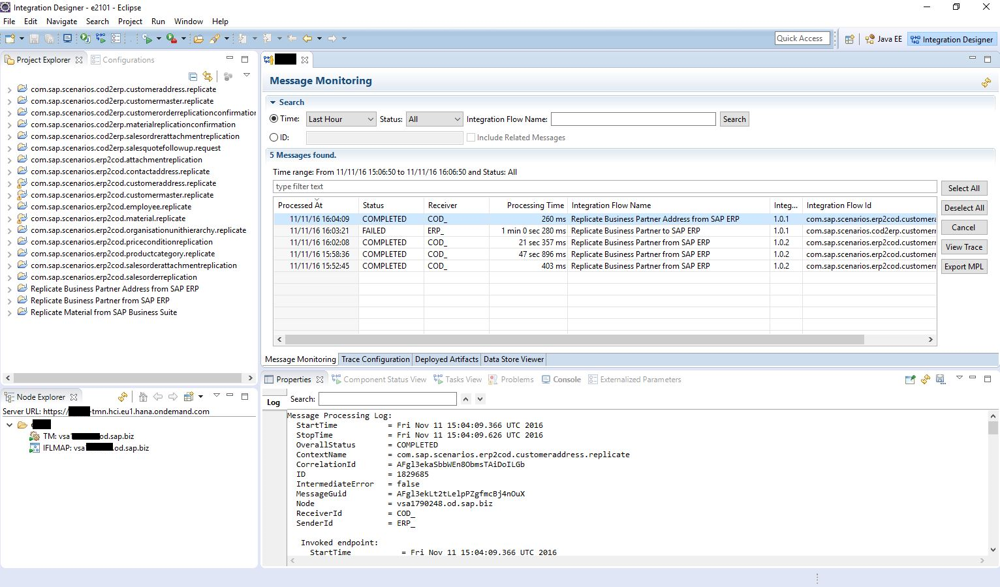
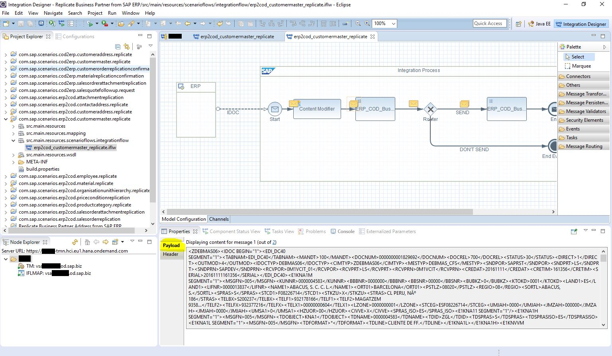

# Habilitar tracing en IFlows de HCI para nuestro tenant

Para habilitar el tracing en nuestro tenant es necesario abrir un ticket a SAP desde el launchadpad de support SAP: <https://launchpad.support.sap.com/>

Una vez hayan habilitado el tracing en nuestro tenant será  necesario configurar el tracing a nivel de iflow. 

Así mismo es necesario establecer el nivel de traza específico para cada IFlow desde el monitor de mensajes en el `WebUI`.

Guardamos y desplegamos. Y ahora habilitamos las trazas (duran un tiempo limitado).

En eclipse Doble click en la carpeta del tenant en el `Node Explorer` y abrimos el `Message Monitoring`.

Ahí selecionamos `Trace Configuration`, selecionamos el Iflow que deseemos monitorizar y pulsamos `Enable`. *(Solo quedará habilitado por un tiempo limitado)*.

Con esto quedaría habilitado el tracing para ese IFlow.
Lanzamos un mensaje y ahora podemos visualizar los payloads en el `Message Monitoring`.

Pulsando en el botón `View Trace` se abrirá el IFlow y podremos visualizar el payload en cada paso del flujo.

