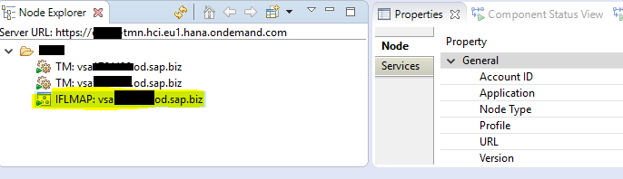
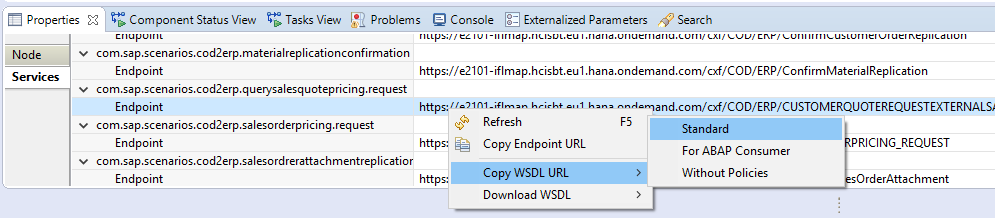

# Obtener WSDLs de servicios desplegados en nuestro tenant de HCI

Desde eclipse, en el `Node Explorer`, doble click sobre nuestro nodo:

Pestaña `Services`, ahí buscamos nuestro IFlow: Click derecho, `Copy WSDL URL > Standard`.

