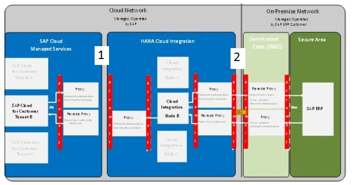
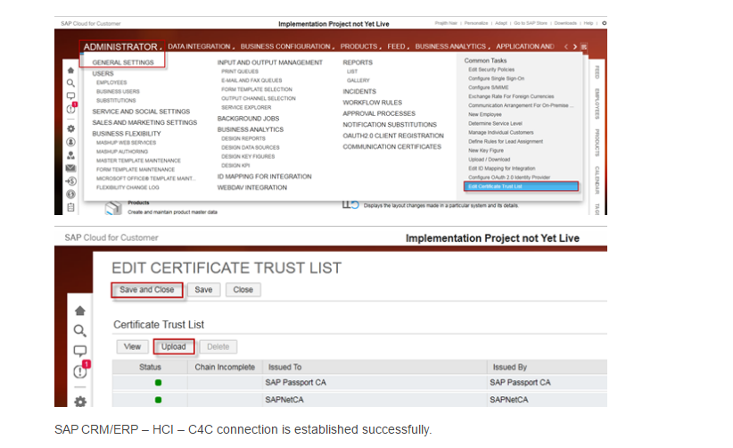

# Configuracion de SSL y certificados

Lo más complicado de la configuración de un nuevo entorno en HCI es la correcta configuración de los túneles SSL y la correcta ubicación de certificados y CAs.

## Configurar SSL

***

### Túnel SSL entre C4C y HCI

* **Configuración en HCI:** Cuando se compra el tenant a SAP, envían el certificado con la clave pública de HCI por email. Este certificado contiene la cadena de certificados con las dos CAs que lo firman (intermedia y root).

Estos dos certificados de las CAs que firman el certificado de HCI deberemos instalarlas en todos las máquinas que vayan a comunicarse con HCI.

Así mismo también deberemos instalar estas dos CAs en SAP, desde la trasacción `STRUST` tanto en el PSE Cliente, como en el PSE Servidor.

* **Configuración en C4C:**  El certificado de C4C viene firmado por la CA de SAP PASSPORT, que HCI ya tiene importada
por defecto en su KeyStore, así que no tenemos que hacer nada tampoco en este punto.

### Túnel SSL entre HCI y SAP
* **Configuración en SAP ECC:** Debemos generar el `PSE Cliente` en la trasacción STRUST con un certificado del cliente que haya sido firmado por una de las CAs que admite HCI. [Lista de CAs admitidas por HCI](https://help.sap.com/viewer/368c481cd6954bdfa5d0435479fd4eaf/Cloud/en-US/4509f605e83c4c939a91b81eb3a6cdea.html)

Una vez generado, debemos importar las dos CAs que han firmado el certificado de HCI.

Del mismo modo debemos generar el `PSE Servidor` en la transacción `STRUST`, utilizando el mismo certificado del punto anterior, y añadiremos también las dos CAs que firman el certificado de HCI, examente igual que con `PSE Cliente`.

* **Configuración en HCI:** No debemos instalar ninguna CA, porque el certificado con el que se ha generado el PSE Cliente en SAP, ya está firmado por una de las CAs instaladas en HCI.