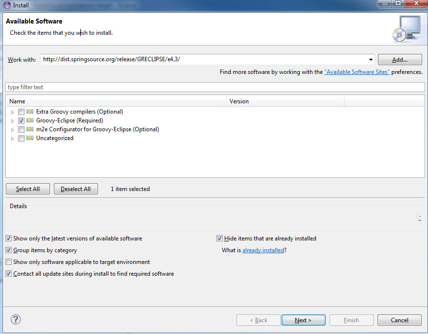
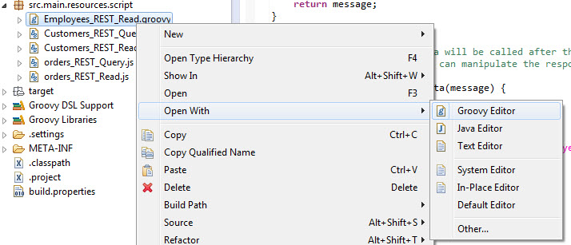
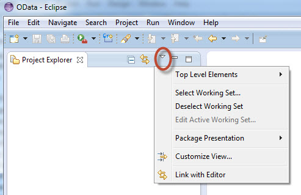
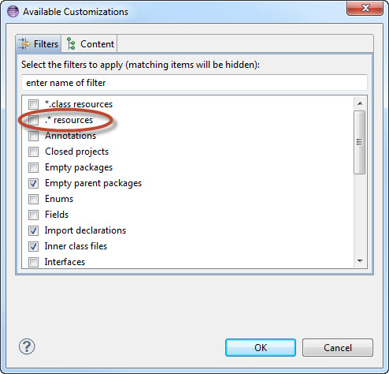

# Groovy Scripting en HCI

HCI nos ofrece la posibilidad de ejecutar [Groovy Scripts] (http://groovy-lang.org/) dentro de flujos de integración para realizar diversas funciones.

Para desarrollar estos scripts lo primero será preparar nuestro eclipse para trabajar con ellos.

## Preparar eclipse para desarrollar Groovy Scripts en HCI

1. **Instalar plugins de Groovy eclipse**

Desde `Help > Install New Software`

````
http://dist.springsource.org/snapshot/GRECLIPSE/e4.6/
````

Seleccionamos `Groovy-Eclipse` y reiniciamos eclipse una vez se complete la instalación.



Con esto ya podemos editar los ficheros `.groovy` con el `Groovy editor` de eclipse.



2. **Añadir Groovy Nature al proyecto**

Debemos indicar que nuestro proyecto contiene ficheros Groovy para que dispongamos de todas las opciones disponibles.

Para ello debemos editar el archivo `.project` contenido en nuestro proyecto.

Este fichero está oculto por defecto en la vista de eclipse. Para poder visualizarlo y editarlo debemos:



Seleccionamos `Customize View > .*resources`.



